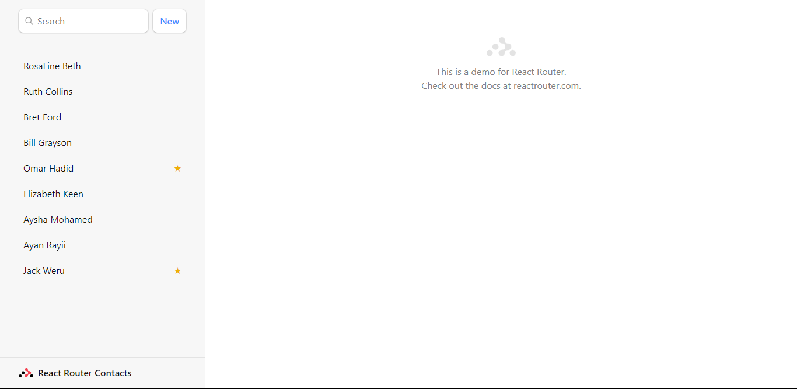
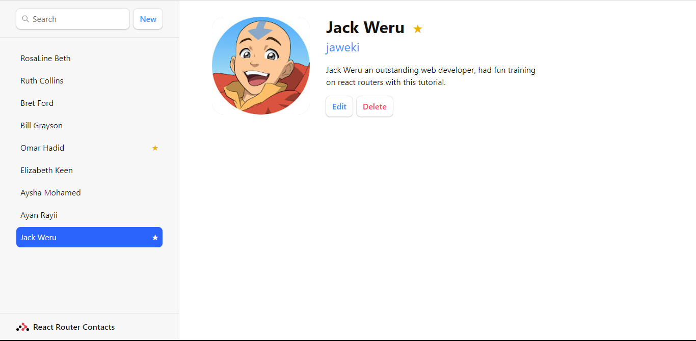
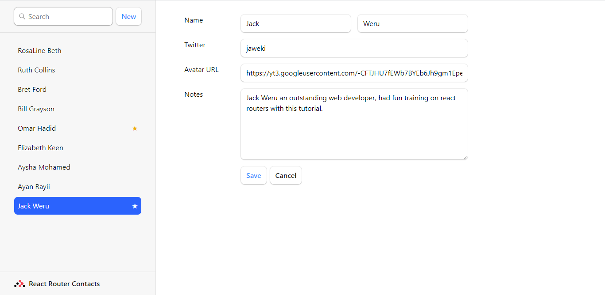

# React App (React-Router-Tutorial) - Contact Tracker App

This app solution, is a simple illustration of how to implement react router in a react app. more about the original source of this tutorials contents can be found at [React router](https://reactrouter.com/en/main/start/tutorial). With upto 70 minutes of concentration, the tutorial is easily achived, and understood with repetitive learning.

## Table of contents

- [Overview](#overview)
  - [Screenshot](#screenshot)
  - [Links](#links)
- [My process](#my-process)
  - [Built with](#built-with)
  - [What I learned](#what-i-learned)
  - [Continued development](#continued-development)
  - [Useful resources](#useful-resources)
- [Author](#author)
- [Acknowledgments](#acknowledgments)

**Note: A more detailed developers document, can be found at [my website portfolio](https://portfolio.jaweki.com)**

## Overview

This build is a small, but feature-rich app that lets you keep track of your contacts. It stores the contacts in your browsers storage. so if you share the contact url with another device, it might not be visible, unless they have the same contact id.
**Contact ID is auto-generated, so its quite difficult to match another contacts id**

### Screenshots





### Links

- Solution URL: [this github repository](https://github.com/Jaweki/contact_tracker-react_router_tutorial)
- Live Site URL: [Contact tracker deployment on vercel](https://contact-tracker-react-router-tutorial.vercel.app/)

## My process

### Built with

- [React](https://reactjs.org/)- JS Library
- CSS custom rules: some flexbox css grid and more css properties...

**Note: if you need to see more of the css used, check out the /src/index.css**

### What I learned

- To start with was installation of the react app and dependancies for this project:

```node
npm create vite@latest contact-tracker -- --template react
cd contact-tracker
npm install react-router-dom localforage match-sorter sort-by
npm run dev
```

- when app and all important inital dependenanceies are installed, configured and the app is runing in local development browser, confiure the react router

```js
import { createBrowserRouter } from "react-router-dom";
import Root from "./routes/root.jsx";

const router = createBrowserRouter([
  {
    path: "/",
    element: <Root />,
  },
]);
ReactDOM.createRoot(document.getElementById("root")).render(
  <React.StrictMode>
    <RouterProvider router={router} />
  </React.StrictMode>
);
```

- Before diving deep into the project, it would be wise to have a user friendly way to handle errors; that is by using an errorElement prop to the root route:

```js
import ErrorPage from "./routes/error-page.jsx";
const route = createBrowserRoute([
  {
    path: "/",
    element: <Root />,
    errorElement: <ErrorPage />,
  },
]);
```

- To allow smooth client experience while navigation the app, a common layout should be maintained between navigation from one contact to another; thus render other pages as child routes:

```js
const route = createBrowserRouter([
  {
    path: "/",
    element: <Root />,
    errorElement: <ErrorPage />,
    children: [
      {
        path: "/homepage",
        element: <Homepage />,
        index,
      },
      {
        path: "/contacts/:contactId",
        element: <Contact />,
      },
    ],
  },
]);
```

- In case the react app uses forms to collect user data or to create new data automatically like generating a contactId for a new contact, instead of using the html <form> element, it would be wise to use a <Form> element provided by react-router-dom.
<Form> element by react router, performs client side routing, instead of sending data to server; i.e., if a method for the form is a POST, the Form element by react router serializes the data input automatically and revalidates the data into a request body for the route action.
If the methods on the Form is a GET, the form manipulates the URLSearchParams, and the params are accessible by a route loader.

example...
For data processing by route loaders and route action, configure the routes as below:

```js
import { action as rootAction, loader as rootLoader } from "./routes/root.jsx";
import {
  action as contactAction,
  loader as contactLoader,
} from "./routes/contacts.jsx";
const route = createBrowserRouter([
  {
    path: "/",
    element: <Root />,
    errorElement: <ErrorPage />,
    loader: rootLoader,
    action: rootAction,
    children: [
      {
        path: "/homepage",
        element: <Homepage />,
        index,
      },
      {
        path: "/contacts/:contactId",
        element: <Contact />,
        loader: contactLoader,
        action: contactAction,
      },
    ],
  },
]);
```

In the file that exports a component use by a route as default, export the relevant action and loader from there too:

```js
/*./route/contacts.jsx*/
import { useLoaderData } from 'react-router-dom'
export async function loader({ params }) { // most relevant in a Form method as Get or page loading
    // more relevant code...
    return // return something e.g. { contacts }
}

export async function action({ request, params }) { // most relevant in a Form method as a POST. the request might contain the request bidy from a Form data
    // read the form data as:
    const data = request.formData();
    // more relevant code...
    return // { return something }
}

export default function Contacts() {
    const { contacts } = useLoaderData();
    return (
        <div>
            /* App page relevant ui jsx implementation */
        <div>
    )
}
```

- Link navigation, instead of using the <a> html tag which causes a full page reload, for client side routing, <Link> or <NavLink> from react-router are use, as they do not cause full page routing. NavLink tags are used when some styling needs to be added to the navigation, e.g. when a certain link is clicked and data is (pending) loading or when a certain link is active.

- useLoaderData() method is used to get the data returned by the loader of the specific route that renders the component.

**Note: With client side routing, we reduce the need to configure state variables, useEffect and useRef. All that is replaced by using loaders, useLoaderData() hook, and key prop in react to keep track of when content of an element changes.**

### Continued Development

- In future projects I might for example get the app to store more specifics such as call/mail logs speceific to contact
- Also probably may be get the app to render more than one root layout.

### Useful reasources

- [React Router Tutorial](https://reactrouter.com/en/main/start/tutorial) - This was the site where i followed up the turorial to make the contact tracker. Really intutive and simple to follow along. It was fun.
- [Chat GPT](https://chat.openai.com/)
- [Bard AI by google](https://bard.google.com/)

## Author

- [Jack Weru | Jaweki](https://portfolio.jaweki.com)

## Acknowledgment

To say am honored to have completed this project successsfully feels great.
Thanks to the AI technologies, mostly Chat GPT and Bard AI, I had the opportunity to train and have meaningful discussions that helped me assimilate the knowledge on react router successfully and in an intergral manner.
Finally thanks to the developer group [Remix](https://remix.run/) for the tutorial in react router. check out their [website](https://remix.run/) to learn more on mordern web development practices and more on client side routing.
